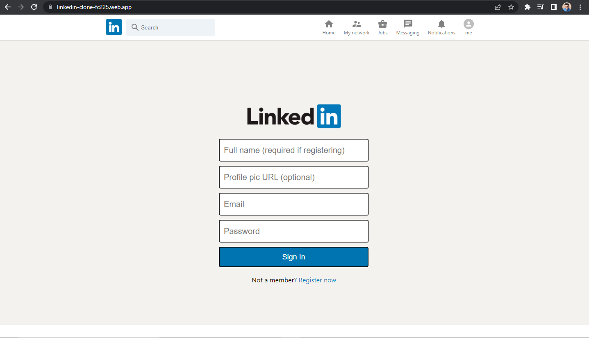
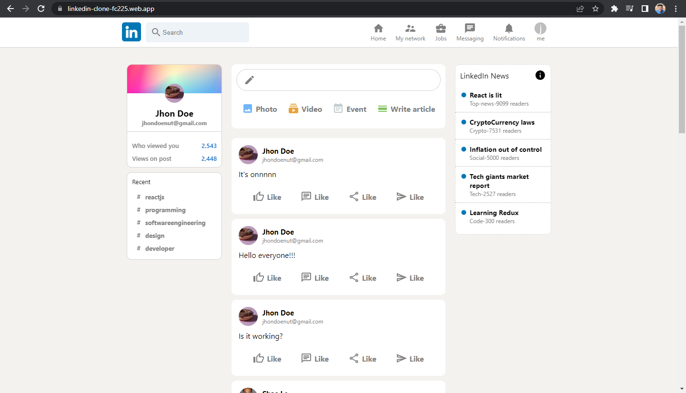
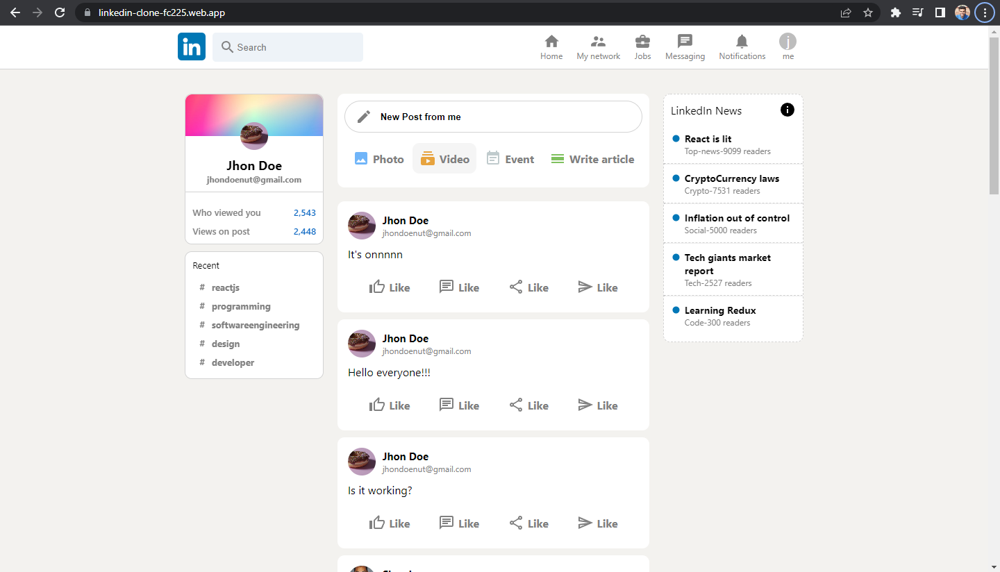
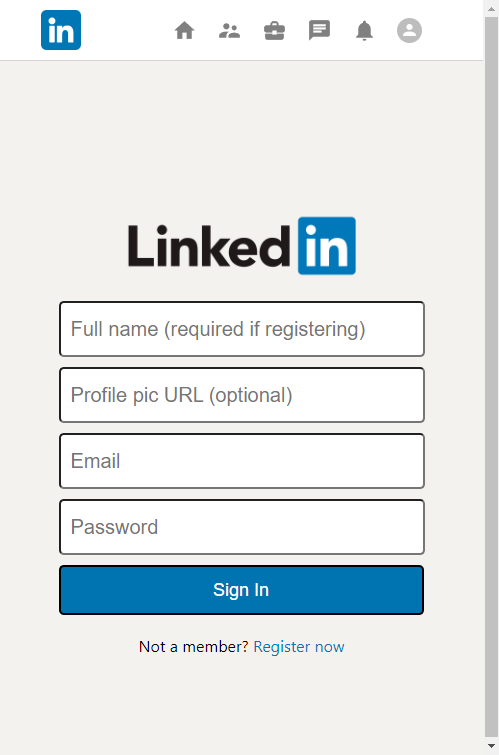
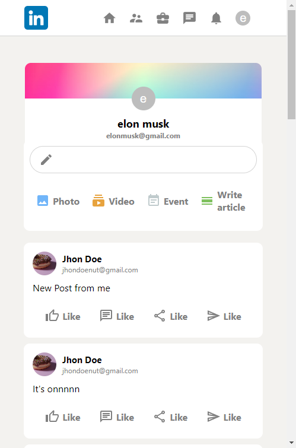
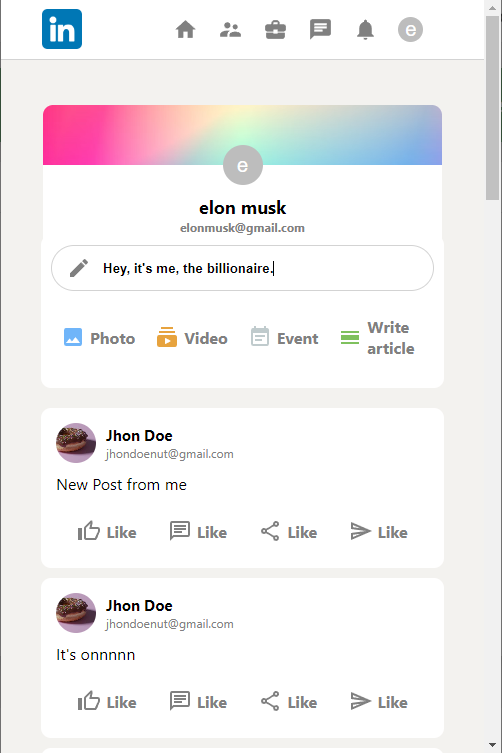
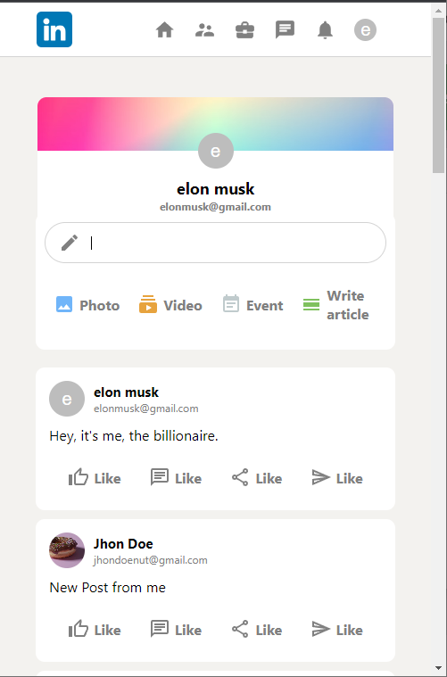
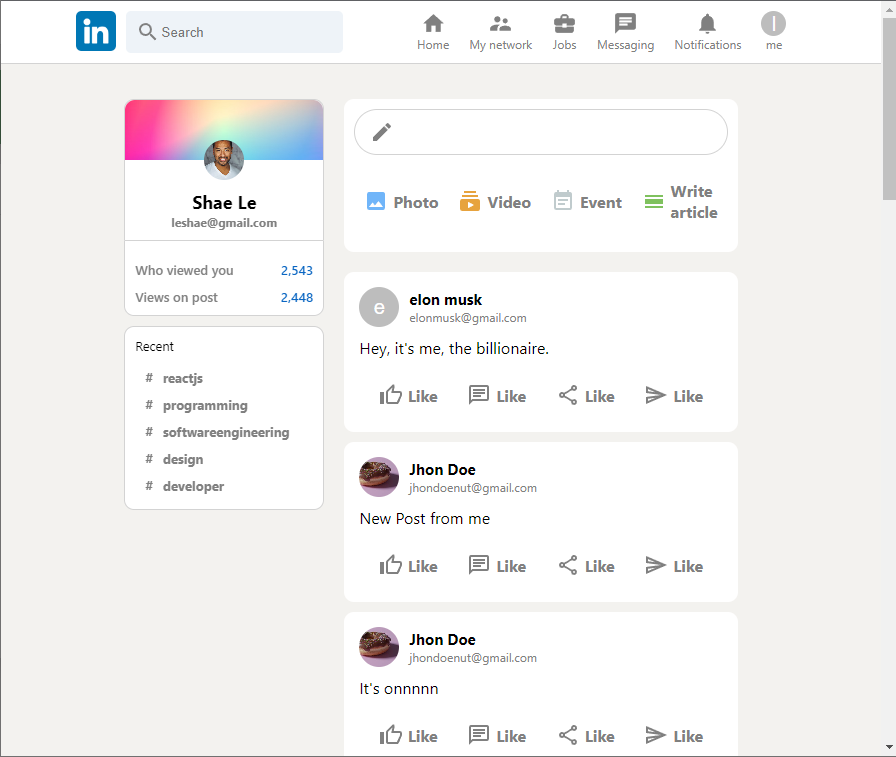
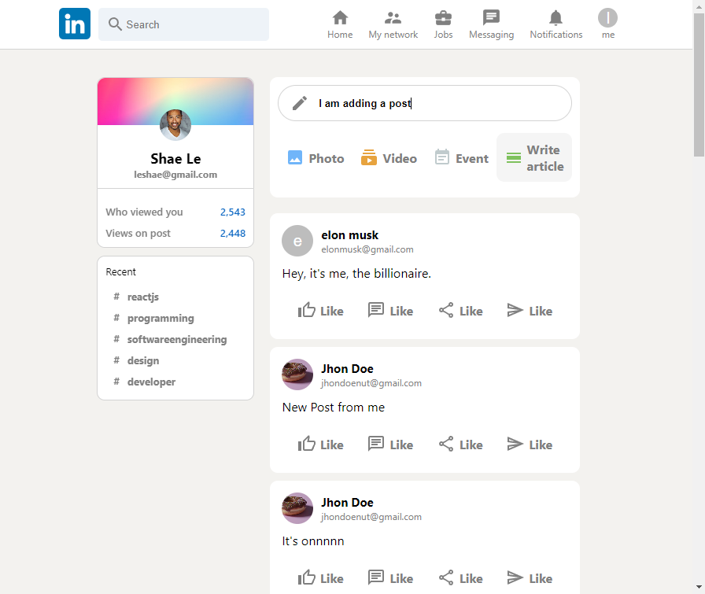

# LinkedIn Clone

## Table of contents

- [Overview](#overview)
  - [Screenshot](#screenshot)
  - [Links](#links)
- [My process](#my-process)
  - [Built with](#built-with)
  - [What I learned](#what-i-learned)
  - [Continued development](#continued-development)
  - [Useful resources](#useful-resources)

## Overview

### Screenshot

<table>
<tr>
<td><b style="font-size:20px">Desktop</b></td>
<td><b style="font-size:20px">Mobile</b></td>
</tr>
<tr>
<td>
  
  
  
  
</td>
<td>
  
  
  
  
</td>
</tr>
<tr>
<td><b style="font-size:20px">Tablet</b></td>
</tr>
<td>
  
  
</td>

</table>

### Links

- Solution URL: [Github Repo](https://github.com/therahulchaurasia/linkedin-clone)

- Live Site URL: [Firebase Hosting](https://linkedin-clone-fc225.web.app)

## My process

### Built with

- Flexbox
- CSS Grid
- [React](https://reactjs.org/) - JS library
- [Firebase](https://firebase.google.com/) - Backend for hosting and authentication

### What I learned

This project was a big one for learning. I was able to do multiple things in the project, like using the Firebase database, authentication, and hosting. In this project, I was able to try out redux. Used a library for the feed section animation and learned a lot of new things while building the application.

### Continued development

There are multiple things that I would like to add in this project.

- More functionality (Header,sidebar,widgets)
- Interaction with posts (Like,share,comment,send)

### Useful resources

- [React Docs](https://reactjs.org/docs/getting-started.html) - To learn more about react.
- [React-Flip-move](https://www.npmjs.com/package/react-flip-move) - For animation

# Getting Started with Create React App and Redux

This project was bootstrapped with [Create React App](https://github.com/facebook/create-react-app), using the [Redux](https://redux.js.org/) and [Redux Toolkit](https://redux-toolkit.js.org/) template.

## Available Scripts

In the project directory, you can run:

### `npm start`

Runs the app in the development mode.\
Open [http://localhost:3000](http://localhost:3000) to view it in your browser.

The page will reload when you make changes.\
You may also see any lint errors in the console.

You can learn more in the [Create React App documentation](https://facebook.github.io/create-react-app/docs/getting-started).

To learn React, check out the [React documentation](https://reactjs.org/).

### `npm run build`

Builds the app for production to the `build` folder.\
It correctly bundles React in production mode and optimizes the build for the best performance.

The build is minified and the filenames include the hashes.\
Your app is ready to be deployed!

See the section about [deployment](https://facebook.github.io/create-react-app/docs/deployment) for more information.
